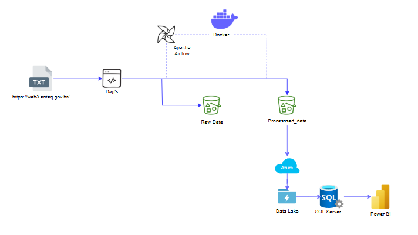

# FIEC

## ETL Process with Airflow, Docker, and SQL Server Integration

This project implements an ETL (Extract, Transform, Load) process using **Apache Airflow** for orchestration, **Docker** for containerization, and **SQL Server** for storing the processed data. The project fetches raw data, processes it, and uploads it to a DataLake, followed by inserting it into a SQL Server database.

## Architecture Overview

The architecture of the project consists of the following components:

### 1. **ETL Pipeline**
   - **Extract**: Data is extracted from remote ZIP files from the ANTAQ website.
   - **Transform**: The extracted data undergoes transformations such as converting date formats, calculating time differences, and preparing the data for further analysis.
   - **Load**: After transformation, the data is saved in two places:
     - **Azure DataLake**: The processed data is uploaded to a DataLake.
     - **SQL Server**: The processed data is inserted into SQL Server for further use in analytical processes.

### 2. **Apache Airflow**
   - **Airflow DAGs** are used to orchestrate the ETL process. The workflow consists of:
     - **ETL Task**: Runs the main ETL script (`main.py`).
     - **Upload Task**: Uploads the processed data to Azure DataLake (`upload_to_datalake.py`).
     - **SQL Insert Task**: Inserts the processed data into SQL Server using SQLAlchemy.

### 3. **Docker**
   - Docker is used to containerize the application, ensuring that it runs the same way in any environment.
   - **Docker Compose** is used to manage and run multi-container Docker applications, including:
     - **Airflow Services**: Scheduler, Webserver, and Worker.
     - **PostgreSQL Database**: Used as the backend database for Airflow metadata.
     - **SQL Server**: Where processed data is inserted.

## Project Setup

### 1. **Prerequisites**
   - Ensure that you have Docker and Docker Compose installed.
   - Create a `.env` file for environment variables like the SQL Server credentials, Azure credentials, etc.

### 2. **Running the Project**
   
   #### Step 1: Build the Docker Image
   ```bash
   docker-compose build
   ```

### **Architecture Diagram**  

  